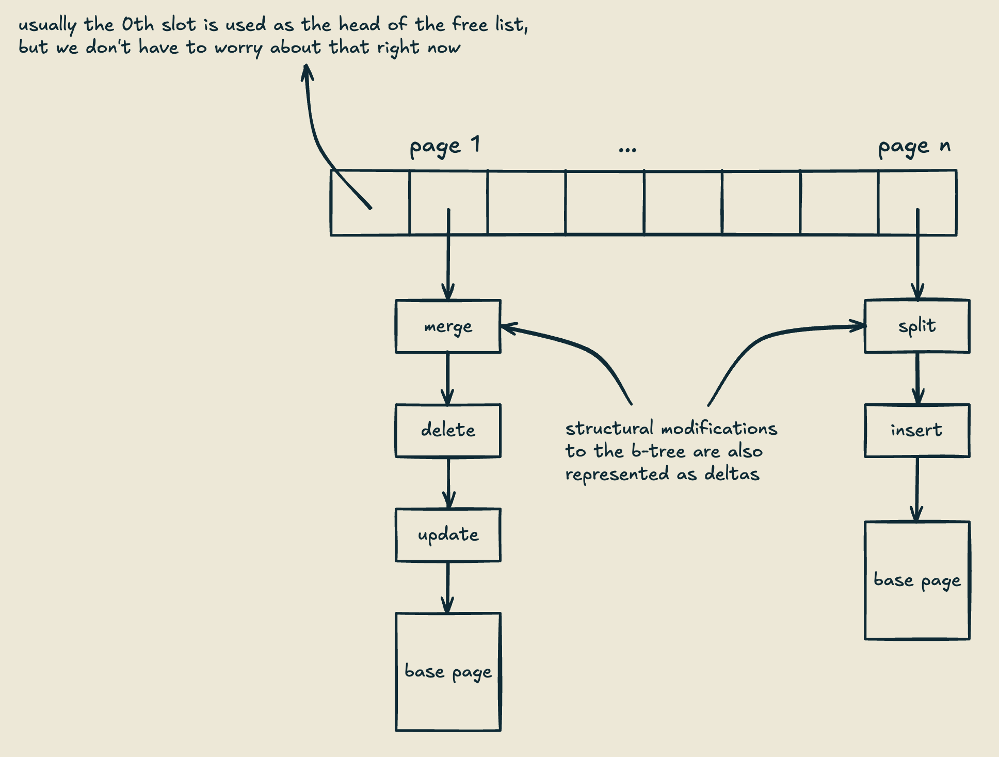
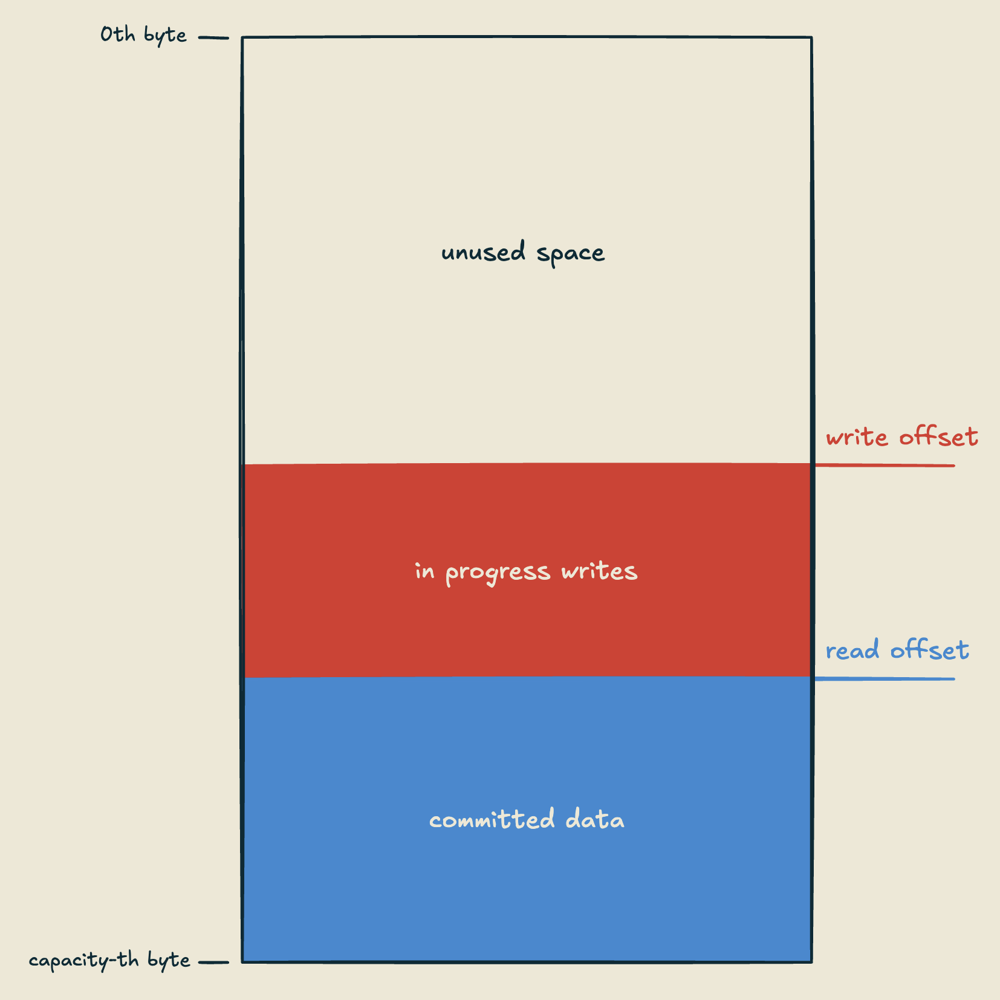
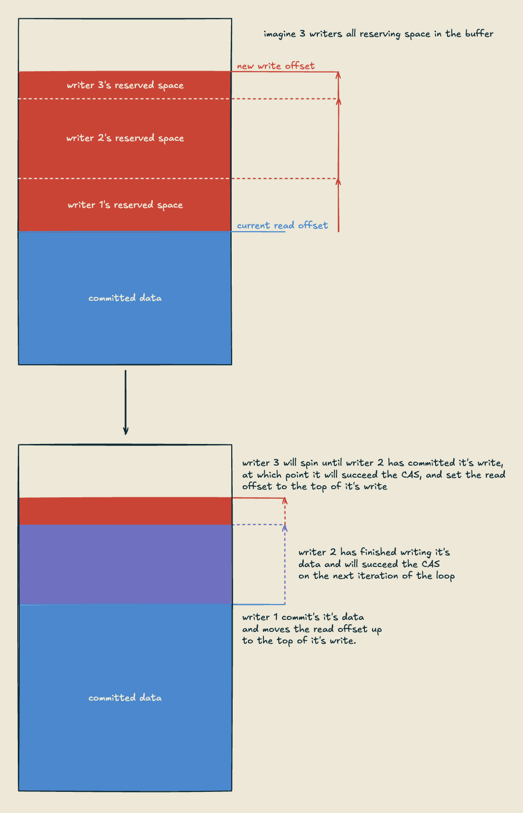

So I genuinely have 0 idea how to start any piece of writing (which is part of why I'm doing this blog), but here's the basic idea. I'm starting to build a database storage engine, something akin to [RocksDB](https://rocksdb.org/) or [WiredTiger](https://source.wiredtiger.com/develop/index.html), and I wanted to do a bit of a devlog for it. It'll probably be a bit stream of consciousness and rough around the edges to start, but hopefully things will get a more structured as I go.

I'll be assuming basic familiarity with database internals for this (although I'm certainly not an expert). If you're not familiar with how databases work, [Andy Pavlo's CMU courses](https://youtube.com/playlist?list=PLSE8ODhjZXjbj8BMuIrRcacnQh20hmY9g&si=HxZaDwWF4eJxZDU9) are a great place to start.

So what's a database "storage engine"? From what I can tell this is a pretty new phenomenon, mostly started by RocksDB. The idea is to build a library that manages the core lower level components (access methods and below) of a database, and acts as a basic key-value store. Most of the time, and in our case, keys and values are just arbitrary byte strings. So the library manages the disk io, memory/caching, and has some kind of index structure to map keys to values. This can be a huge benefit for people implementing full fledged DBs, as a lot of the complexity these days has moved to managing some kind of distributed system, but this kind of system can also be super useful for any kind of software that needs to manage indexed access to persistent data.

## design goals
An important distinction to make at the start is that we're gonna be targeting OLTP databases. This means the primary unit of work we want to support here is a transaction. The library may or may not actually handle transactions in the traditional sense, but we still need to care about them, because it dictates the type of workloads we'll see in our system. More specifically, this means we're not going to target "write heavy" or "read heavy" workloads, but rather we want to support "some arbitrary sequence of reads and writes with additional guarantees about atomicity and durability etc". This will be important when we start shopping for an index structure.

I also want to point out that this is a pretty general purpose system. Databases are already inherently general purpose, and we're making a *library* for a DB subsystem, so it has to be even more general purpose. This means for handling things like read heavy vs write heavy workloads, we want these to be tunable knobs as much as possible, rather than embedded in the underlying structure of the system. To be clear, there's absolutely a benefit to specializing, and databases will often be specialized somewhat to specific use cases, but at a certain point, it stops being a database and becomes "the system you built for your application to manage it's persistent data". Again, this is *not necessarily a bad idea*, but it's not a database.

> <u><strong>A Brief Aside On Language Choice</strong></u>
> I'm writing this in rust, **the main reason for this choice is that it's just the language I have the most experience with.** I'll just leave it at that.

## about that index structure
Most key value stores like this will use either a traditional b-tree, or an lsm tree, as the main indexing structure. After what I just said about not optimizing specifically for read or write heavy workloads, you might think a b-tree is the obvious choice. After all, LSM trees are for write heavy workloads, right? Wellll, kinda. They definitely handle write heavy workloads better than anything else, but to me, that isn't the main reason to use one.

Remember, we're trying to optimize for *transactions in general*, so we want our read and write performance, at least wrt the underlying structure of our system, to be relatively balanced. Typically, b-trees tend to have pretty good performance for reads, writes, and sequential scans, but the problem comes when we look at how modern hardware works. Most databases were originally designed to use spinning disk drives as their underlying storage medium, and these drives generally have pretty balanced speeds when it comes to reads and writes. Random access is slower than sequential access on a traditional hard drive (moving the arm is super slow, so file seeks suffer a lot), but for both random and sequential access, reads and writes tend to be pretty comparable performance wise.

For modern SSDs however, the story is different. There's no mechanical arm that needs to be moved on an SSD, which makes random access a *lot* faster, but they have some idiosyncrasies when it comes to reads vs writes. The problem is that the flash cells on an SSD can wear out over time, so they conceptually have a fixed upper limit on the number of times you can write to them. To combat this, SSDs typically have internal mechanisms for kind of "load balancing" (I'm not a hardware expert so I'm probably not getting this 100% right, but the implications for the software are the same nonetheless) writes to different cells, in an effort to maximize the life span of the device. They may even have extra reserve cells that get used when cells wear out. All of this is extra work and bookkeeping that the device has to do whenever we write to it, and it makes any given individual write a lot slower than a read.

So we have hardware that performs really well for random reads, but poorly for random writes, and we want to support read heavy and write heavy workloads ~equally well. How do we get around this? Well the solution is pretty simple, we just batch up our writes. By doing lots of individual writes in one big chunk, we can sort of "hide" the overhead that the hardware has for the write, so that each individual write has the appearance of only being penalized by a small portion of that overhead. This is one of the main reasons for the rise of LSM trees.

Additionally, log structured storage has benefits when it comes to how modern cpus work as well. Most modern cpus have a lot of cores, with deep cache hierarchies. Without going into too much detail (because I'll probably get it wrong), if we have the same data that's cached on different cores, and one of them updates it, the cpu has to invalidate the cached data to keep everything coherent. This means if we have lots of cores all updating the same memory in place, the cpu has to do extra work to keep the caches coherent, *and* we're likely evicting that data from other cores' caches. With a log structured system (setting aside compaction for now), data is immutable. When we apply a write to some data, we don't do it in place, but rather we just create a new piece of data describing the write that happened logically to the underlying original data. This means we don't have to invalidate data that's in cache, because it didn't *physically* change, all we did is create more data.

One downside though, is that LSM trees kind of go "all in" on this discrepancy, to the point that the entire system is hyper optimized for writes, and a lot of extra tricks (such as bloom filters, etc) need to be done to make the reads not suffer as a result. It would be great if we had a system that took advantage of the benefits of log structuring, while still having an overall architecture that supports the general purpose workload that we're targeting well.

## bw-trees
Lucky for us, the fine folks over at Microsoft have built exactly what we're looking for. [This paper]() describes an index structure called a bw-tree. In a nutshell, it's a log structured b-tree. It also goes a step further by making the entire structure lock free, with the goal of enabling a very high degree of concurrent access. I won't go into a ton of detail right now, I mostly want to talk about the page structure, but here's a basic overview.

The central index for accessing pages is called a mapping table. For now, just assume that there's a fixed number of pages in the system. If we say page ids are unsigned 64 bit integers, the mapping table is just an array indexed by page id. The *contents* of the array is the interesting part. Each slot in the mapping table contains an atomically accessed pointer to the head of a linked list, which is how pages are represented in memory. Basically, when we want to do a write, we encode it somehow as a "delta" of the current page state. So like, if we added a new key-value pair to a leaf page, the delta might look like:

```rust
// this isn't correct syntax but you get the idea
struct InsertDelta {
	key: [u8],
	val: [u8],
	next: *PageNode,
}
```

And at the bottom of the linked list we'd have some original "base page" that represents the state of the page before we started making updates to it, and this would look mostly like a typical btree page (with a little less header info and bookkeeping since we're not doing things in place). The whole thing might look something like this:



When we want to add a delta to a page, we load the current page head pointer from the mapping table, and add that as our next pointer, then do a CAS (compare and swap) on the current pointer in the mapping table to try and update the mapping table to point to our new delta.

If you're not familiar with compare and swap, it's the basic building block of how locks (and a ton of other synchronization mechanisms) are built. It's an atomic operation that allows us to check if a value is what we think it is, and set it to something else if we're right. With the guarantee that another thread won't sneak in and change things while we're in the middle of doing the operation (which may happen if you just did this with normal control flow logic). So in our case, we check if the current mapping table pointer is the one we loaded previously (i.e. no other thread added a new delta while we were in the middle of building ours), and if it is, we set it to point to our new delta, all in one atomic operation.

Reads are super simple, you just load the head pointer from the mapping table, and traverse the delta list until you find what you need, or you reach the base page. Super simple, but potentially a bit slow, especially if the list get's super long, we'd have to do this long linear search, and we'd lose a lot of the benefit that the btree gives us in the first place. To combat this, the btree logic has some way to decide when to compact the page. To do this, a thread just traverses a page list, and adds the data into a new base page (throwing away deletes and changing updates to the most recent version, etc.). Then we do another CAS to set the mapping table pointer to a new base page.

Now, it may just be me, but I'm not a huge fan of linked lists. They get used a lot in lock free data structures, because a lot of the time they can make your life a lot easier in that environment. In this instance though, I'm not convinced that's the case. One of the thing's that stuck out to me when reading the paper is how hairy this makes memory management. To start (and we probably won't be able to get rid of this completely), when we swap out a page list for a newly minted base page, we don't know that there aren't other threads reading the old list still, so we need some way to know when they're done and we can delete (or more likely reuse) the memory of the old page list. The paper describes an epoch mechanism for doing this, there's a lot of ways to deal with this problem, but none of them are particularly fun. Also, all of these delta nodes are going to be different sizes, which makes reuse even more complicated, and tracking our overall memory usage (which we need to do if we want to know when to evict stuff from the cache) gets either complicated, or slow, or both. Not to mention, allocation itself is usually pretty expensive, not only will we potentially have to request memory from the OS, but most allocators use *locks* internally to manage concurrent access, which like, you know, kind of defeats the point of doing this whole dance.

A lot of these issues can probably be solved by using a custom allocator. We'd have a centralized place for tracking memory usage, better control over how we reuse (and request) memory, and could potentially pull off removing locks from the picture, and hopefully get some more concurrency back. So, I started playing around with building something like that, and ended up coming up with a new structure for the pages themselves that solves most of these problems (with some trade offs), and I think will give us some big wins when implementing the other systems in the library.

## Page buffers
The basic idea is something I'm gonna just call a "page buffer." A page buffer is just a fixed capacity buffer of bytes, with two atomic integers indicating the "write offset" and "read offset." It looks something like this:

```rust
struct PageBuffer {
	buf: NonNull<[u8]>,
	read_offset: AtomicUsize,
	write_offset: AtomicIsize,
}
```


Both the write and read offsets start at `capacity`. With initialization looking roughly like this:

```rust
impl PageBuffer {
	pub fn new(capacity: usize) -> Self {
		assert!(capacity <= isize::MAX as usize);
		let layout = Layout::array::<u8>(capacity).unwrap();

        let ptr = match NonNull::new(unsafe { alloc_zeroed(layout) }) {
            Some(nn) => nn,
            None => handle_alloc_error(layout),
        };
        let buf = NonNull::slice_from_raw_parts(ptr, capacity);

        Self {
            buf,
            read_offset: AtomicUsize::new(capacity),
            write_offset: AtomicIsize::new(capacity as isize),
        }
	}
}
```

The assert at the top helps us ensure that we can fit the capacity in our write offset, and [handles some weirdness with how LLVM does pointer offsets](https://doc.rust-lang.org/nomicon/vec/vec-alloc.html)

To read from a page buffer, all a reader has to do is load the current read offset, and grab a slice of our buffer starting at that offset, like so:

```rust
impl PageBuffer {
	// ...
	pub fn read(&self) -> &[u8] {
		let read_offset = self.read_offset.load(Ordering::Acquire);
        let b = &unsafe { self.buf.as_ref() }[read_offset..];
        b
	}
	// ...
}
```

This means a reader only has to do a single atomic load to access a contiguous slice of the entire current state of a buffer, no pointer chasing required.

Now, why is our write offset an `isize`? Writes are a bit trickier than reads, and they require three steps. First, a writer will decrement the write pointer to reserve space for it's data. If there's enough space in the buffer for the new data (which we know if the new write offset is >= 0), the writer will then write into the section of the buffer it reserved. Finally, the writer will do a CAS loop on the *read offset*, with `current` being the bottom of it's write, and `new` being the top. This ensures that writes are committed in the order they are reserved, and our readers always see fully contiguous data. The process looks something like the following:


```rust
impl PageBuffer {
	// ...
	pub fn reserve(&self, len: usize) -> Result<WriteGuard, ()> {
        let old_write_offset = self.write_offset.fetch_sub(
	        len as isize, Ordering::SeqCst
	    );
        let new_write_offset = old_write_offset - len as isize;
        if new_write_offset < 0 {
            // no room left in the buffer
            return Err(());
        }
        let write = &mut unsafe { self.buf.as_ptr().as_mut().unwrap() }
            [new_write_offset as usize..old_write_offset as usize];
        Ok(WriteGuard {
            write,
            p: self,
            bottom: old_write_offset as usize,
        })
    }
	// ...
}
struct WriteGuard<'w> {
    pub write: &'w mut [u8],
    p: &'w PageBuffer,
    bottom: usize,
}
impl Drop for WriteGuard<'_> {
    fn drop(&mut self) {
        while let Err(_) = self.p.read_offset.compare_exchange_weak(
            self.bottom,
            self.bottom - self.write.len(),
            Ordering::SeqCst,
            Ordering::SeqCst,
        ) {}
    }
}
```

So what happens when a buffer fills up? Any log structured storage system will have some notion of how it handles *compaction*. Because we are appending writes, rather than doing them in place, at some point we will want to convert our time-ordered updates into a key-ordered page, to keep search efficient. In the Microsoft papers, they leave this decision up to the access methods. Meaning, somewhere in the b-tree logic, we would have some notion of "too many nodes" in the linked list, and a worker coming across a page with too many nodes would compact them into a separate base page, and do a CAS to update the page in the mapping table when it's done. One of the issues with this is that a worker doing a CAS to install a new compaction may fail if another worker completed the compaction before it. Duplicate efforts to perform compaction are possible, and in such a situation, only one worker will succeed, the rest will just have to throw away all of that work.

Luckily, with a page buffer, we have a good way to know both when to perform compaction, and which worker is responsible for doing it. When a page buffer's write offset drops below 0, the page is "sealed" and needs to be compacted. Any new writers discovering a sealed buffer will fail to access it, but new readers are allowed. So we have a way to make sure no new writers come in and mess with our buffer when we need to compact it, but how do we pick a writer to do the compaction? We could do something like reference counting here, and just have the last writer accessing a page be the compactor, but if we pay attention to how our writes are committed, the "last writer" is already known, it'll be the writer with the highest write point in the buffer. More specifically, the writer that *causes* a buffer to go from not sealed to sealed (changes the write offset from positive to negative), is responsible for performing the compaction, and it can just spin until the write before it is committed. If we adjust the `reserve` function from before, we can see how this might work.

```rust
impl PageBuffer {
	// ...
	pub fn reserve(&self, len: usize) -> Result<WriteGuard, ()> {
        let old_write_offset = self.write_offset.fetch_sub(
		    len as isize, Ordering::SeqCst
        );
        let new_write_offset = old_write_offset - len as isize;
        if new_write_offset < 0 {
            if old_write_offset >= 0 {
                // we caused the buffer to be sealed
                // first we wait for the other writers to finish
                while self.read_offset.load(
	                Ordering::Acquire
	            ) != old_write_offset as usize {}
                todo!("now we can do some compaction")
            }
            return Err(());
        }
        let write = &mut unsafe { self.buf.as_ptr().as_mut().unwrap() }
            [new_write_offset as usize..old_write_offset as usize];
        Ok(WriteGuard {
            write,
            p: self,
            bottom: old_write_offset as usize,
        })
    }
	// ...
}
```

This ability to ensure no new writers access a page after it's sealed, and to know which worker is responsible for handling a sealed page, is super powerful, and can likely be expanded to handle other hairy things like page merge and split in the b-tree. That being said, it does leave some questions on the table, namely: what do we do about pages that are no longer in the mapping table, but still have some readers?

I won't address this issue in this post, but it's definitely a solvable problem. We could use reference counting, but again since we know there's only one writer after a certain point, we have some more tools at our disposal. Specifically, this problem of reclaiming concurrently accessed memory when there's only one writer is solved well by RCU (read-copy-update). You can implement RCU with reference counting, but more commonly (because it's faster), you can use an epoch mechanism similar to the one outlined in the bw-tree paper. With how we've set this up, it *should* be much simpler than the epoch mechanism in the paper, but we'll have to see.
